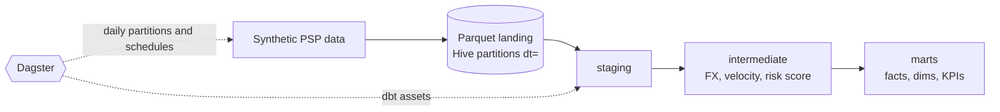

# Fintech Payments Risk Pipeline

[](https://github.com/julifalvo/fintech-payments-risk-pipeline/actions/workflows/ci.yml)


An end-to-end data pipeline for a **payment service provider (PSP)**. It lands daily card
transactions and chargebacks, scores every transaction for fraud risk, and publishes the
tables that risk, fraud-ops and commercial teams use every day.

Runs fully local and free: `uv` + DuckDB + Parquet, with Docker and CI included.

## Business problem

A PSP processing ~4,000 transactions a day across 6 countries needs to:

1. **Catch fraud early.** Flag risky transactions (high amount, velocity bursts, cross-border
   activity, new accounts, high-risk merchant categories) for manual review.
2. **Monitor merchants.** Card networks penalize merchants whose chargeback rate goes above
   roughly 0.9%, so the commercial team needs a daily merchant scorecard.
3. **Measure the rules.** Every alert costs analyst time. The team needs to know how many
   alerts turn into confirmed fraud (precision) and how much fraud is caught (recall).

On the included synthetic data, the rule engine reaches about **74% precision and 70% recall**
against fraud chargebacks. That is the baseline an ML model would have to beat.

## Architecture



Design decisions and the full asset graph are in [docs/architecture.md](docs/architecture.md).

## Stack

| Layer | Tool | Why |
|---|---|---|
| Orchestration | **Dagster** (assets, daily partitions, schedules) | Asset lineage from Parquet to marts, partition backfills, observability |
| Transformation | **dbt** (dbt-duckdb) | Layered SQL models, tests, contracts, unit tests, docs |
| Warehouse | **DuckDB** | Fast local OLAP engine that reads Parquet directly. Swap for Snowflake or BigQuery via profile |
| Storage | **Parquet** (zstd, Hive-partitioned) | Open columnar format used by lakehouses |
| Language | **Python 3.12**, **SQL** | |
| Tooling | **uv**, **ruff**, **pytest**, **pre-commit** | Reproducible, locked environments and fast linting |
| Delivery | **Docker**, **GitHub Actions** | Same run locally and in CI |

## Data model

| Layer | Model | Grain / purpose |
|---|---|---|
| staging | `stg_payments__*` | Typed, renamed, deduplicated source data |
| intermediate | `int_transactions__enriched` | Transaction + customer + merchant + FX (USD) |
| intermediate | `int_transactions__velocity` | Rolling 1h count and 24h USD volume per customer |
| intermediate | `int_transactions__scored` | Risk flags, weighted score 0-100, level, reasons |
| marts | `fct_transactions` | 1 row per transaction, **incremental** |
| marts | `fct_chargebacks` | 1 row per chargeback, with days to report |
| marts | `dim_customers`, `dim_merchants` | Reference dimensions |
| marts | `mart_merchant_daily_kpis` | Merchant x day: TPV, approval rate, chargeback rate, alerts |
| marts | `mart_fraud_alerts` | Review queue with confirmed-fraud label |
| marts | `mart_risk_rule_performance` | Daily precision and recall of the rule engine |

### Risk scoring rules

| Flag | Condition | Weight |
|---|---|---|
| `high_amount` | amount >= USD 1,000 | 35 |
| `velocity` | >= 5 transactions by the same customer in 1h | 30 |
| `cross_border` | IP country differs from the customer's country | 15 |
| `new_account` | account younger than 30 days | 10 |
| `high_risk_merchant` | crypto, gaming or digital goods | 10 |

Alert when `risk_score >= 50`, and level `high` from 70. All thresholds are dbt `vars` in
`dbt/dbt_project.yml`.

## Quickstart

Requires [uv](https://docs.astral.sh/uv/). It installs Python 3.12 automatically.

```bash
git clone https://github.com/julifalvo/fintech-payments-risk-pipeline.git
cd fintech-payments-risk-pipeline
uv sync

# 1. Land a week of synthetic data into data/landing (idempotent)
uv run payments ingest --start 2026-09-01 --end 2026-09-07

# 2. Build and test the warehouse
cd dbt && uv run dbt build --profiles-dir . && cd ..

# 3. Explore the results
uv run python -c "import duckdb; print(duckdb.connect('data/warehouse/payments.duckdb').sql('select * from marts.mart_risk_rule_performance'))"
```

### Run with Dagster

```bash
uv run dg dev          # UI at http://localhost:3000
```

In the UI, materialize `raw_transactions` for a date range (a backfill), then the dbt assets.
You can also turn on the schedules.

### Run with Docker

```bash
docker compose up --build   # Dagster UI at http://localhost:3000, data persisted in volumes
```

On Linux or macOS, `make pipeline`, `make test`, `make lint` and `make dagster` wrap the commands above.

## Data quality

`dbt build` runs **models, 48 data tests, 2 unit tests and enforced contracts** in DAG order.
A failing test stops everything downstream of it.

- **Keys**: `unique` and `not_null` on every primary key, plus grain tests on aggregated marts.
- **Integrity**: `relationships` from transactions to customers, merchants and FX, and from chargebacks to transactions.
- **Domains**: `accepted_values` on status, channel, KYC level, risk tier and reason codes.
- **Ranges**: custom generic test `value_between`, for rates in [0, 1] and scores in [0, 100].
- **Business rules**: singular test that a chargeback is never reported before its transaction.
- **Logic**: dbt unit tests pin the scoring weights and the NULL handling.
- **Contracts**: every mart enforces column names and types.

Python tests (`uv run pytest`) cover generator determinism, partition idempotency and Parquet schemas.

## CI

GitHub Actions runs on every push and pull request:

1. `ruff check`, `ruff format --check`, `pytest`
2. Ingest 7 days, then `dbt build` (all tests and contracts), then `dg check defs`. dbt artifacts are uploaded.
3. Docker image build, with the build cache stored in GitHub Actions.

## Project structure

```
├── src/payments_pipeline/   # generator, ingestion, CLI, Dagster assets & definitions
├── dbt/                     # dbt project: models/{staging,intermediate,marts}, seeds, tests, macros
├── tests/                   # pytest suite
├── docs/architecture.md     # diagrams and design decisions
├── .github/workflows/ci.yml
├── Dockerfile, docker-compose.yml, Makefile
└── pyproject.toml, uv.lock
```

## Roadmap

- Chargebacks arriving weeks after the transaction (a feed partitioned by `reported_at`).
- Daily FX rates in place of the static seed.
- Replace or augment the rules with a gradient-boosted model, compared with `mart_risk_rule_performance`.
- Terraform plus a cloud warehouse target (Snowflake or BigQuery) and object storage (S3 or GCS).

## Disclaimer

All data is synthetic and generated deterministically by `src/payments_pipeline/generator.py`.
No real customer, card or merchant data is used.

## License

[MIT](LICENSE)
