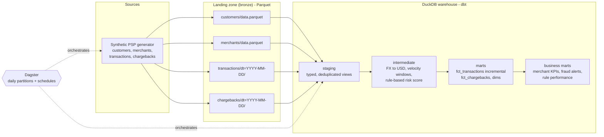

# Architecture & design decisions

## Data flow

## Dagster asset graph

| Asset | Partitioned | Schedule |
|---|---|---|
| `raw_customers`, `raw_merchants` | no (snapshot) | daily 00:30 UTC |
| `raw_transactions`, `raw_chargebacks` | daily (`dt`) | daily 01:00 UTC, previous day |
| dbt models (staging -> marts) | no | daily 02:00 UTC |

dbt sources declare `meta.dagster.asset_key`, so the dbt DAG is stitched to the ingestion
assets and the whole lineage (Parquet -> marts) is visible in the Dagster UI.

## Decisions

**Parquet landing + DuckDB warehouse.** Keeps the project free and reproducible on a laptop
while using the same patterns as a cloud lakehouse (object storage + SQL engine). Swapping
DuckDB for Snowflake/BigQuery/Databricks only requires a new dbt profile and adapter; models
use ANSI SQL except `qualify` and `filter`, which those engines also support.

**Idempotency at every layer.**
- Ingestion overwrites a whole partition atomically (write to `.tmp`, then `os.replace`).
- Staging deduplicates on the business key with `qualify row_number()`.
- `fct_transactions` is incremental with `delete+insert` on `transaction_id` and a
  configurable lookback (`incremental_lookback_days`) to absorb late data.

**Rules before ML.** The risk score is a transparent, weighted rule set whose thresholds live
in dbt `vars`. `mart_risk_rule_performance` measures precision/recall against fraud
chargebacks, giving a baseline any future ML model must beat.

**Contracts on marts.** Every mart has an enforced dbt contract (column names and types),
so a breaking change fails the build instead of silently breaking dashboards.

**Testing pyramid.**
- Python unit tests: generator determinism, partition idempotency, Parquet schemas.
- dbt unit tests: risk scoring logic on hand-written fixtures.
- dbt data tests: keys, referential integrity, accepted values, value ranges, grain.

## Known limitations / next steps

- Chargebacks are generated alongside their transaction's partition; in reality they arrive
  weeks later. A `reported_at`-partitioned feed plus a longer incremental lookback would model that.
- FX rates are a static seed; production would use a daily FX source joined on date.
- `dagster dev` in Docker is a single-node setup. Production would split webserver and daemon
  and use Postgres for Dagster run storage.
- Add source freshness checks and alerting (Slack) on failed asset checks.
